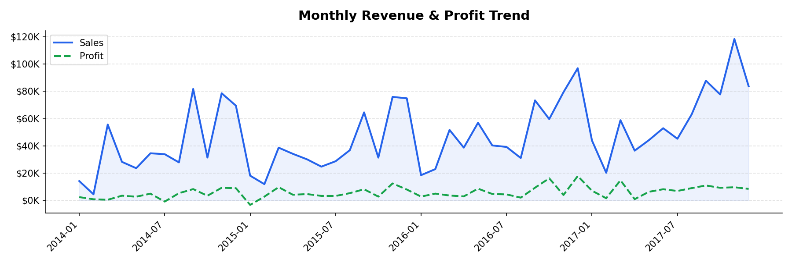
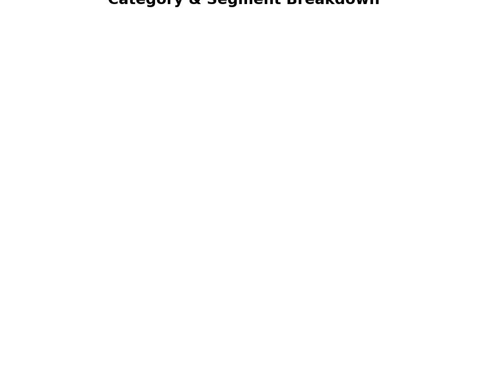
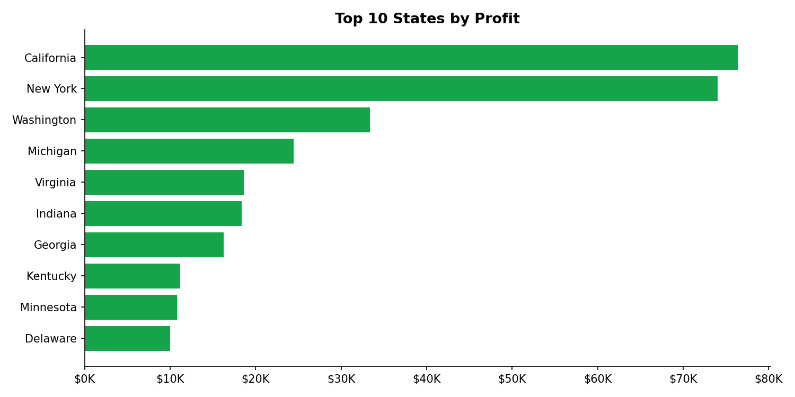

# 📊 Sales Dashboard Analysis — Superstore Dataset


> An end-to-end data analysis project exploring **$2.3M in sales data** across 4 years, 3 product categories, and 50 US states — with interactive visualizations and actionable business insights.

---

## 🔍 Problem Statement

A retail superstore wants to understand:
- Which categories and regions drive the most profit?
- Is heavy discounting hurting the bottom line?
- How has revenue trended year-over-year?

This project answers these questions through exploratory data analysis (EDA), static charts, and an interactive Plotly dashboard.

---

## 📁 Project Structure

```
sales-dashboard/
│
├── sales_dashboard.py       # Main analysis script
├── Sales Dashboard.ipynb    # Jupyter Notebook version (with outputs)
│                            # Superstore.csv — not included, download separately
├── outputs/
│   ├── monthly_trend.png
│   ├── category_segment.png
│   ├── top_states.png
│   ├── discount_vs_profit.html
│   └── interactive_dashboard.html
│
├── .gitignore
├── requirements.txt
└── README.md
```

> ⚠️ `Superstore.csv` is **not included** in this repo (Kaggle terms of use). See [Getting Started](#-getting-started) to download it.

---

## 📊 Key Insights

| # | Finding | Impact |
|---|---------|--------|
| 1 | **Technology** drives the highest profit margin (~17%) despite lower order volume | Focus marketing budget here |
| 2 | **Tables & Bookcases** are loss-making sub-categories at high discount rates | Review discount policy |
| 3 | **Discount–Profit correlation: –0.22** — more discount = less profit overall | Cap discounts at 20% |
| 4 | **California & New York** account for ~30% of total profit | Prioritize these markets |
| 5 | Revenue grew **~20% YoY** from 2014 to 2017 | Healthy growth trajectory |

---

## 📈 Visualizations

> 📸 Screenshots below are generated after running the project. See `outputs/` folder for interactive HTML dashboards.

### Monthly Revenue & Profit Trend


### Category & Segment Breakdown


### Top 10 States by Profit


> Interactive charts (Discount vs Profit, Yearly Dashboard) are in the `outputs/` folder as `.html` files — open in any browser.

---

## 🛠️ Tech Stack

| Tool | Purpose |
|------|---------|
| `pandas` | Data wrangling & aggregation |
| `numpy` | Numerical operations |
| `matplotlib` + `seaborn` | Static charts |
| `plotly` | Interactive dashboard |
| `Jupyter Notebook` | Narrative-style presentation |

---

## 🚀 Getting Started

### 1. Clone the repo
```bash
git clone https://github.com/YOUR_USERNAME/sales-dashboard.git
cd sales-dashboard
```

### 2. Install dependencies
```bash
pip install -r requirements.txt
```

### 3. Download the dataset
Get the **Superstore dataset** from Kaggle:
🔗 https://www.kaggle.com/datasets/vivek468/superstore-dataset-final

Place `Superstore.csv` in the root folder.

### 4. Run the analysis
```bash
# As a Python script
python sales_dashboard.py

# Or open the notebook
jupyter notebook "Sales Dashboard.ipynb"
```

---

## 📦 Requirements

```
pandas>=2.0.0
numpy>=1.24.0
matplotlib>=3.7.0
seaborn>=0.12.0
plotly>=5.15.0
jupyter>=1.0.0
```

---

## 💡 What I Learned

- How to build an end-to-end EDA pipeline from raw CSV to polished visuals
- Using Plotly to create shareable, interactive HTML dashboards
- Business thinking: connecting data patterns to real decisions (discount strategy, regional focus)
- Clean code structure for a reproducible analysis project

---

## 📌 Next Steps

- [ ] Add a Streamlit web app for live filtering
- [ ] Automate monthly report generation with a scheduler
- [ ] Build a churn prediction model on top of this dataset

---

## 🙋 About

Built by **[Your Name]** | [LinkedIn](https://linkedin.com/in/YOUR_LINKEDIN) | [GitHub](https://github.com/YOUR_GITHUB)

*Part of my Data Analyst Portfolio — open to data analyst / business analyst roles.*

---

⭐ **If this helped you, drop a star on the repo!**
